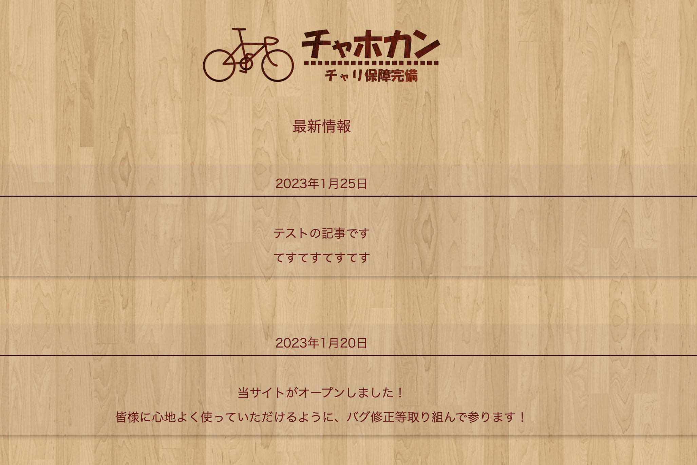
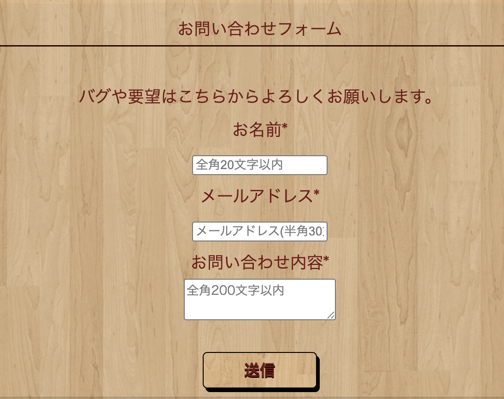

# chahokan_web_service

社内ポイントサービスにおけるポータルサイトのプロトタイプ

## プロジェクト概要

このプロジェクトは、社内でのポイント購買サービスのための Web ポータルサービスのプロトタイプです．

## スクリーンショット





## 主な機能

- ユーザー登録・ログイン機能
- 商品ラインナップの閲覧
- マイページでの個人情報管理
- ポイント交換システム（SNS での#チャホカンタグ付け投稿によるポイント獲得）
- お問い合わせ機能
- 管理者画面でのユーザ情報管理

## プロジェクト構成

```
chahokan_web_service/
├── public_html/        # Webサイトのメインコンテンツ
│   ├── aboutme/        # サイト説明ページ
│   ├── basic/          # ヘッダー・フッターなどの共通コンポーネント
│   ├── contact/        # お問い合わせページ
│   ├── css/            # スタイルシート
│   ├── db/             # データベース接続
│   ├── images/         # 画像ファイル
│   ├── join/           # 会員登録・ログインページ
│   ├── js/             # JavaScriptファイル
│   ├── main/           # メインページ
│   ├── mypage/         # マイページ関連
│   ├── new/            # 最新情報ページ
│   └── shop/           # 商品一覧ページ
├── xserver_php/        # PHPの設定ファイル
│   └── session/        # セッション管理
└── mail/               # メール関連ファイル
```

## データベース設計

システムは以下のテーブルで構成されています。

### subscribe テーブル（ユーザー情報）

```
subscribe
├── id              # ユーザーID（主キー、自動採番）
├── name            # ユーザー名（ログイン用）
├── pen_name        # ニックネーム
├── email           # メールアドレス
├── password        # パスワード（平文保存）※実運用時は暗号化推奨
├── is_admin        # 管理者フラグ（0:一般ユーザー, 1:管理者）
├── point           # 保有ポイント
└── timestamp       # 最終ツイート日時
```

### shop テーブル（商品情報）

```
shop
├── item_id         # 商品ID（主キー）
├── item_name       # 商品名
├── cost            # 必要ポイント
├── url             # 商品詳細URL（Amazon等）
└── image           # 商品画像のパス
```

### pre_user テーブル（仮登録ユーザー情報）

```
pre_user
├── pre_token       # 登録用トークン
├── pre_email       # メールアドレス
├── pre_date        # 登録日時
└── pre_flag        # 登録フラグ（0:仮登録中, 1:本登録済み）
```

### for_admin テーブル（ポイント交換履歴）

```
for_admin
├── ex_name         # 交換したユーザー名
├── ex_item         # 交換した商品名
├── ex_hash         # 交換ID（ハッシュ値）
└── ex_timestamp    # 交換日時（自動設定）
```

## 環境構築

1. PHP が動作する Web サーバー環境を用意
2. MySQL データベースを設定
3. データベース接続情報を`public_html/db/dbconnect.php`に設定
4. Web サーバーのドキュメントルートに`public_html`ディレクトリを配置

## ライセンス

MIT

## 開発について

私の初めての Web 開発です．
フレームワークを使わず，フルスクラッチで PHP を書き，大変学びが深まった経験でした．
はやりのフレームワークで安定したものを作り直して見たいと考えています．
